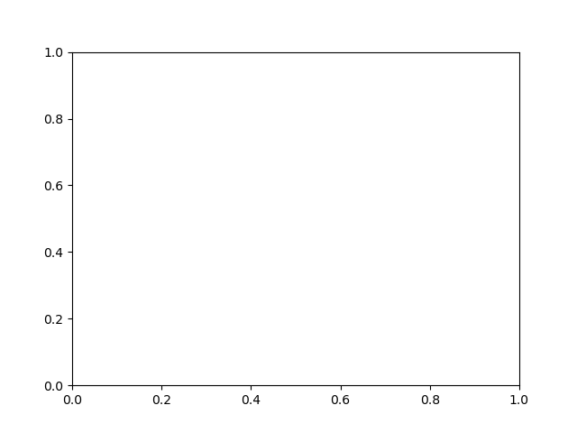
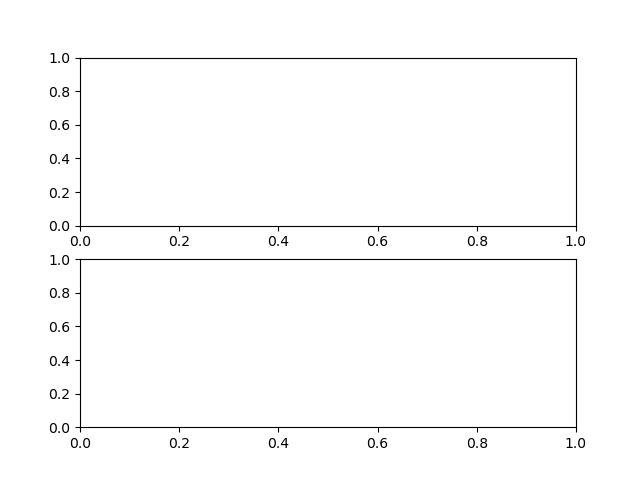
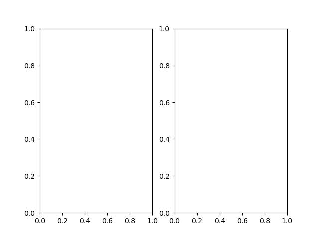

**Ceci est une prise de note sur ma compréhension de Matplotlib et surtout des besoins que j'en ai.**

Je m'inspire grandement de la documentation officielle que j'ai grossièrement traduit et adapté à mon approche. 
Je vois un nombre de choses fausses sur le net qui est assez déconcertante, le pire étant sur Stack Overflow où l'on balance des réponses sans même comprendre son fonctionnement. Le problème est ce que la réponse peut donner le résutat escompté mais de manière détourné.

Les bases
=========

Matplotlib est une bibliothèque en Python servant à produire des graphiques et à les visualiser. 

Elle trace vos données dans ce que l'on appelle une "Figure" qui va contenir un ou plusieurs axes graphiques.

Quelle version utilisons-nous?
'''
import matplotlib
matplotlib.__version__
'''

Tout commence par l'import de la bibliothèque 

```
import matplotlib.pyplot as plt 
```

Par cette ligne de code nous disons à Python que l'on va exploiter des fonctions se trouvant dans le fichier pyplot.py se situant le répertoire matplotlib.
Ce fichier est important car les fonctions servant à créer les graphiques sont de dedans
Mon poste personnel est sous arch-linux et les bibliothèques sont stockées à cet endroit:

**/usr/lib/python3.9/site-packages**

```
/usr/lib/python3.9/site-packages/matplotlib 
 $  ls py*
pylab.py  pyplot.py
```

Nous parlions d'axes graphiques dans une Figure. Concrétisons visuellement ce propos.

```
import matplotlib.pyplot as plt 
#Crée la "Figure" en question. Sur un même rendu, peut afficher 1 à n graphique.
plt.subplots()
#Affiche visuellement un graphique vide avec les axes abscisses et ordonnées.
plt.show()
```


Faire subplots(1,1) ou subplots(1) équivaut à faire subplots()


Maintenant si nous faisons subplots(2)? puis subplots(1,2)?



Nous voyons bien sur les deux dernières images que les graphiques ont été doublés verticalement et horizontalement.
On peut en ajouter autant que l'on souhaite en afficher.

Terminologie Matplotlib
Il y a du jargon au premier abord non intuitif lorsque l'on débute, que l'on voit souvent dans les échanges anglophone.
En voici quelques uns:
Figure: est l'objet qui va contenir votre ou vos graphiques. Il faut voir cela comme un conteneur.
Axe: C'est le graphique en lui même avec tout ce qu'il va contenir ( le titre l'axe des abscisses et des ordonnées, le tracé visuelle de vos données)
Axis: ce sont les axes des abscisses et des ordonnées. 
Tick: ce sont les graduations sur vos axes des axes des abscisss et des ordonnées.

Il y a deux façons de créer vos graphiques avec matplotlib:
- où l'on dit explicitement ce que l'on va créer ( et donc avoir une meilleure maîtrise de ce que l'on fait), Figure, Axes etc... 
- L'autre méthode où l'on passe par pyplot pour qu'il produise lui-même les  Figure, Axes etc... On s'occupe uniquement du tracé de nos données.

Il y a une troisième manière de créer qui serait d'intégrer Matplotlib dans une application, mais je n'aborderai pas ce dernier.

Quand utiliser l'une ou l'autre méthode?
Il est conseillé d'utiliser la première méthode lorsque l'on veut intégrer son code dans un programme, que le code doit pouvoir être réutilisable.
La seconde approche se ferait plutôt lorsque l'on voudrait un rendu à chaud, voir ce que cela donnerait comme dans le mode interactif de Python ou bien jupyter le but étant de visualiser la donnée rapidement.

Backends:
C'est le support sur lequel va se faire le tracé de vos données.
Il peut être de deux types:
Le "user interface backends" et le "hard copy backend". Le dernier est le fait de créer un fichier image à partir de votre graphique pour le sauvegarder et l'utiliser plus tard sur votre sur site web statique ou bien dans une présentation. Celui-ci est dit "non-interactive backends"
Cela se concrétise dans le code de cette manière:
'''
matplotlib.pyplot.savefig('nom_du_fichier.png') #Vous pouvez remplacer png par une autre extension
'''
Le premier type est de passer par des bibliothèques graphique comme GTK,QT,Tkinter par exemple pour créer vos graphiques. Celui-ci pourra être utilisé dans un programme ou un processus dynamique/interactif, on dit qu'il est "interactive backends". Evidemment pour utiliser un backend particulier il faut au préalable avoir installer les paquets necéssaires à pouvoir l'utiliser.

**Choisir un backend influe sur le rendu du graphique.**
Nous pouvons nommer les deux grandes famille à savoir le rendu vectoriel et matriciel.

Il y a trois façons de configurer son backend:
Dans le fichier matplotlibrc
Dans la variable d'environnement MPLBACKEND
Ou bien directement dans le code avec la fonctione matplotlib.use()

Si aucun backend n'est défini il détéctera automatiquement le backend utilisable et l'utilisera.

Les types:
==========

Attention, lorsque vous créez vos graphiques, gardez bien en tête le type de données que vous souhaitez afficher car ceci peu en modifier l'aspect visuel.
'''
>>> i = 10
>>> type(i)
<class 'int'>
>>> i = '10'
>>> type(i)
<class 'str'>
>>> i = [10]
>>> type(i)
<class 'list'>
#String dans une liste
>>> i = ['10']
>>> type(i)
<class 'list'>
#Entier dans une liste
'''

Par exemple, il est toujours bon de faire attention à vos données une fois intégrées dans une liste, car le type peut nous tromper.
